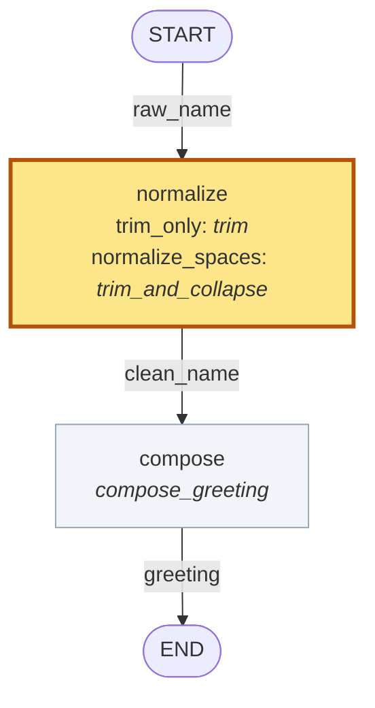

# workflow-workbench

**Let an AI coding agent build a workflow unsupervised and it produces code that works and is
incoherent.** Not broken — that you would notice. Incoherent: a fan-out whose results are
silently dropped, two wires crossed between values of the same type, a stage nobody implemented.
It runs, it returns something of the right shape, and nothing downstream can tell.

Workflow Workbench is a declaration layer over Pydantic Graph Builder. You write the workflow's
shape and its data contracts as **data**, before any step exists — which is what makes that class
of defect findable:

```python
spec.coherence_check()      # 11 well-formedness rules, 7 of them with nothing implemented
spec.diagram()              # a picture of the same declaration
spec.render(strategy)       # refuses outright if anything blocks
```

So the agent gets an acceptance test it cannot talk its way past, and you get a drawing of the
design before you read a line of its code.

Four problems, and the same declaration answers all four:

| | |
|---|---|
| **An agent's output works and is incoherent.** Each piece is locally fine; the whole does not add up. | `coherence_check()` — 11 well-formedness rules, 7 needing nothing implemented |
| **A reasoning strategy cannot be asserted correct — only compared.** There is no right answer to diff against, so "better" is an empirical question. | `eval_battle()` — same cases, same evaluators, plus a replicate arm as the noise floor |
| **Complexity grows unless pieces are reused.** Two arms that differ in one stage should say so, not be two files. | the data language: declare a role once, bind it many ways; `SubgraphBinding` reuses a whole child design as one node |
| **You cannot see what you built.** | `diagram()` and `diff_diagram()`, from the declaration alone |

On that last one, honestly: Pydantic Graph **can** emit mermaid — `build_mermaid_graph` in
`graph_builder.py`. Two differences, not a long list. It takes a BUILT graph's internals, so every
implementation must exist first; ours reads the declaration, so the picture arrives before the
code. And ours can draw **two strategies at once**, greying what they share and highlighting what
differs, which is a question about a comparison rather than about a graph.

Pydantic Graph executes the workflow; Pydantic Evals evaluates its results.

Built on [Pydantic Graph](https://ai.pydantic.dev/graph/) and
[Pydantic Evals](https://ai.pydantic.dev/evals/). Independent; not affiliated with Pydantic.

## What it looks like

One workflow — normalize a name, then compose a greeting from it:

| step | input | output |
|---|---|---|
| `normalize` | raw name, `str` | normalized name, `str` |
| `compose` | normalized name, `str` | greeting, `str` |

Desired behaviour: preserve the name's words, trim surrounding whitespace, collapse repeated
internal whitespace, return `Hello, {name}!`.

Two strategies disagree about how much of that `normalize` does. `compose` is the same function
in both, so the comparison diagram highlights the one node that varies:



Both satisfy the same declared types and structure, and every check passes for both. Only the
evaluation separates them:

| case | input | `trim_only` | `normalize_spaces` |
|---|---|---|---|
| `padded` | `"  Ada Lovelace  "` | `Hello, Ada Lovelace!` | `Hello, Ada Lovelace!` |
| `inner_run` | `"Ada   Lovelace"` | ✗ `Hello, Ada   Lovelace!` | `Hello, Ada Lovelace!` |
| `both` | `"  Grace   Hopper  "` | ✗ `Hello, Grace   Hopper!` | `Hello, Grace Hopper!` |
| `already_clean` | `"Alan Turing"` | `Hello, Alan Turing!` | `Hello, Alan Turing!` |
| | **exact-match score** | **0.50** | **1.00** |

A **battle** runs both strategies over the same cases with the same evaluators — here exact
matching against the expected greeting. `0.50` is two of four: a result on this four-case
demonstration dataset and nothing beyond it.

`eval_battle` also scores one strategy against itself; that replicate is the noise floor a real
delta has to clear. It is `0.00` here because both implementations are deterministic — a `0.00`
floor on a model-backed arm usually means a cache answered the second run.

The whole example: [`examples/greeting.py`](examples/greeting.py).

## Quickstart

Python 3.12 or newer, and [uv](https://docs.astral.sh/uv/). No API keys: the example is pure
string handling and calls no model.

```bash
git clone https://github.com/borisdev/workflow-workbench
cd workflow-workbench
uv sync --no-dev --extra evals
uv run python3 -m examples.greeting
```

Everything it produces goes to the terminal; no files are written. Excerpt:

```
1. coherence_check() with nothing implemented: clean
...
3. what varies between the two strategies: {'normalize': ('trim', 'trim_and_collapse')}
...
   case           input                  trim_only                  normalize_spaces
   inner_run      'Ada   Lovelace'       'Hello, Ada   Lovelace!'   'Hello, Ada Lovelace!'
...
   noise floor (same strategy twice): {'ExactMatch': 0.0}
   trim_only        0.50
   normalize_spaces 1.00
```

Two mermaid blocks go past on the way: the specification, and the comparison above. A browser
viewer is available as a separate process — `uv run python3 -m workflow_workbench.cli serve`, see
[`serve.py`](workflow_workbench/serve.py) — and nothing in the quickstart needs it.

## The development sequence

| | step | what you can inspect |
|---|---|---|
| 1 | specify the workflow | the nodes, named values and edges, as data |
| 2 | check and draw it | `coherence_check()` findings and `diagram()` mermaid, with nothing implemented |
| 3 | implement the steps | ordinary Pydantic Graph step bodies |
| 4 | bind a named strategy | `diagram(strategy)` — the design with each role's implementation named |
| 5 | check the strategy | missing bindings, wrong return types, and `render()` refusing outright |
| 6 | execute and evaluate | outputs per case, scores, `varies()` and `diff_diagram()` |

Stages 2 and 5 are what a specification buys, and neither needs a second strategy: one
implementation per step still gets a drawing before it is written and a refusal when one is
missed.

## What `coherence_check()` enforces

<!-- rules:start -->
**11 rules.** `coherence_check()` returns one finding per violation and an empty list for a clean design; `render()` refuses on any finding that blocks.

**7 need no implementations at all** — runnable the moment `nodes` and `edges` are written.

| check | rule |
|---|---|
| `check_names` | Node names must be unique — `render()` uses them as graph node ids. |
| `check_reachable` | Every node reachable from START, and every node able to reach END. |
| `check_variables` | Per edge: the variable it carries must be an output of its source and an input of its target. |
| `check_step_arity` | A step body receives exactly ONE value, so a node cannot consume two inputs at once. |
| `check_decisions` | `when` appears exactly on the edges leaving a decision, and nowhere else. |
| `check_transform_edges` | A transform edge is fixed (`apply=`) or a variation point (bound) — exactly one. |
| `check_fan_out_rejoins` | Everything a fan-out produces must reach a join before it reaches END. |

**4 more once a strategy exists**, checking the implementations against the roles they fill.

| check | rule |
|---|---|
| `check_bindings` | The strategy binds exactly the declared VARIATION POINTS — no missing, no extra. |
| `check_implementations` | Each bound CALLABLE is callable and takes exactly one positional argument (`ctx`). |
| `check_subgraphs` | Every child design used as a node implementation fits the node it is bound to. |
| `check_variable_types` | Each implementation returns the type its role is declared to produce. |
<!-- rules:end -->

Every one of these exists because it caught something that otherwise **ran and returned a
plausible answer**. Each check's docstring in [`checks.py`](workflow_workbench/checks.py) carries
the measured case that produced it.

**These are structural checks, not a proof of correctness.** A step that returns its input
untouched satisfies every rule above and still does nothing — that is the boundary between what a
specification checks and what an evaluation measures, which is why `eval_battle` exists.

A finding is a `CoherenceFinding`: a `str` subclass, so it reads as the sentence it is, carrying
`check`, `about` and `blocking` so an agent can branch on structure rather than parse English. A
`NOT CHECKED — …` finding is a **stated gap**, not a pass, and does not block `render()`.


## The same example, in five stages

### 1. Declare the nodes, the named values, and the edges

```python
raw_name = VariableSpec("raw_name", str)
clean_name = VariableSpec("clean_name", str)
greeting = VariableSpec("greeting", str)

normalize = StepSpec("normalize", inputs=(raw_name,), outputs=(clean_name,))
compose = StepSpec("compose", inputs=(clean_name,), outputs=(greeting,))

class Greeting(GraphSpec):
    name = "greeting"
    input_type, output_type = str, str
    nodes = (normalize, compose)
    edges = (EdgeSpec(source=START, target=normalize, carries=raw_name),
             EdgeSpec(source=normalize, target=compose, carries=clean_name),
             EdgeSpec(source=compose, target=END, carries=greeting))
```

`clean_name` and `greeting` are both `str`, which is why they are separate variables: no type
checker can catch `compose` being wired to the wrong one when there is only one type in the room.
A name can. Edge fields are keyword-only and `carries` is required — four interchangeable-looking
slots are one transposition away from a graph that is wrong and runs.

#### The data language

<!-- language:start -->
A design is **data** — tuples of these, in a class body. Nothing executes, which is what lets `coherence_check()` and `diagram()` read it before a single step is written.

**Values** — What flows. Named, so a mis-wiring is visible when the types are identical.

| | |
|---|---|
| `VariableSpec` | A named, typed value that may flow along an edge. |

**Boxes** — Every box the design declares. Only a step takes an implementation.

| | |
|---|---|
| `StepSpec` | A semantic role with a typed contract. Deliberately implementation-free. |
| `JoinSpec` | The one thing that can combine several arrivals into one value. |
| `DecisionSpec` | A router. Sends the value down one branch, chosen by its TYPE. |
| `NodeSpec` | `StepSpec` \| `JoinSpec` \| `DecisionSpec` |

**Wires** — How values move. The kind of edge is the kind of movement.

| | |
|---|---|
| `EdgeSpec` | One wire: `source -> target`, carrying `carries`. |
| `MapEdgeSpec` | Fan out: `carries` is a collection, and the target runs ONCE PER `delivers`. |
| `TransformEdgeSpec` | A cheap SYNCHRONOUS reshape that happens ON THE WIRE, creating no node. |

**Endpoints** — The graph's own boundary, declared like anything else.

| | |
|---|---|
| `START` | The graph's entry. |
| `END` | The graph's exit. |

**The design, and what fills it** — One design, many competing sets of implementations.

| | |
|---|---|
| `GraphSpec` | Subclass it, declare `nodes` and `edges`. That is the whole interface. |
| `StrategySpec` | A complete Bindable -> implementation mapping. One competitor. |
| `SubgraphBinding` | A whole child design — `GraphSpec` + `StrategySpec` — used as ONE node's implementation. |
| `Bindable` | `StepSpec` \| `TransformEdgeSpec` |

The two unions are annotations, not classes you instantiate — calling either one raises `TypeError`. They exist so a signature can say *any declared box*, or *anything a strategy must bind*, and have it type-check.
<!-- language:end -->

### 2. Check it and draw it, before implementing anything

```python
spec = Greeting()
spec.coherence_check()      # -> [] — no strategy, no implementations, no engine
spec.diagram()    # -> mermaid for the specification
```

This is the stage a built `Graph` cannot reach: a `Graph` needs every function to exist first.

### 3. Implement the steps, then bind them as named strategies

The step bodies are ordinary Pydantic Graph steps — nothing in them refers to this library:

```python
async def trim(ctx) -> str:
    return ctx.inputs.strip()

async def trim_and_collapse(ctx) -> str:
    return " ".join(ctx.inputs.split())

async def compose_greeting(ctx) -> str:
    return f"Hello, {ctx.inputs}!"

trim_only = StrategySpec("trim_only", {normalize: trim, compose: compose_greeting})
normalize_spaces = StrategySpec("normalize_spaces",
                                {normalize: trim_and_collapse, compose: compose_greeting})
```

### 4. An incomplete strategy is refused at declaration time

A strategy binds **every** node, including ones it does not change. Leave one out and the check
says so; `render()` refuses rather than building a graph with a hole in it:

```python
unfinished = StrategySpec("unfinished", {normalize: trim_and_collapse})
spec.coherence_check(unfinished)
# ["strategy 'unfinished' does not bind node 'compose'. Every one is bound explicitly,
#   including unchanged ones — a partial strategy makes 'what varies between these arms'
#   unanswerable without reading both files."]
spec.render(unfinished)   # raises SpecError with the same finding
```

A finding is a sentence, and it is also **structured**. `CoherenceFinding` is a `str` subclass, so
everything above reads exactly as it looks — and an agent driving this as its acceptance test can
branch on fields instead of matching on prose:

```python
f = spec.coherence_check(unfinished)[0]
f.check       # 'check_bindings'  — which check produced it
f.about       # 'compose'         — the node; 'source->target' for an edge; '' for the design
f.blocking    # True              — False only for a `NOT CHECKED — …` stated gap

from workflow_workbench import blocking
blocking(spec.coherence_check(unfinished))    # what `render()` refuses on, gaps excluded
```

`blocking` is a bool rather than a severity enum because there are two states and no third has
turned up. A stated gap and a clean pass must never read the same — that is the one distinction
`coherence_check()` has always made, and it used to be recoverable only with `startswith("NOT CHECKED")`.

Which is what makes growing a workflow safe: add a node and every existing strategy fails loudly
rather than skipping a step it never heard of
([`stage3_new_node.py`](examples/ladder/stage3_new_node.py)).

### 5. Construct the graphs and evaluate both strategies

`spec.diagram()` draws the specification; `spec.render(strategy)` constructs a real
`pydantic_graph.Graph` — their object, their executor, their `iter()`:

```python
graph = spec.render(normalize_spaces)
graph.run_sync(inputs="  Ada   Lovelace  ")      # 'Hello, Ada Lovelace!'

floor = eval_battle(spec, trim_only, trim_only, dataset())          # the noise floor
battle = eval_battle(spec, trim_only, normalize_spaces, dataset())  # the comparison
```

`eval_battle` takes one `spec` and two strategies, so both arms render from the same nodes, edges
and types. There is nowhere to put a second design.

## What the checks guarantee, and what they do not

The specification supplies the structure and the data contracts; a strategy supplies
implementations; `render()` constructs the graph from those declarations. There is no second,
separately maintained wiring definition to drift from them — `edges` is the only way a graph gets
wired, with no hook and no override, so a strategy can change what a node *does* and cannot change
what the workflow *is*.

What the checks in [`checks.py`](workflow_workbench/checks.py) detect:

| check | catches |
|---|---|
| `check_names` | two nodes with one name — they become one graph node id |
| `check_reachable` | a node unreachable from `START`, or unable to reach `END` |
| `check_variables` | an edge carrying a value its source does not produce or its target does not take |
| `check_step_arity` | two unconditional arrivals into one step: it runs twice and one result is dropped |
| `check_bindings` | a strategy binding too few nodes, or one the design does not declare |
| `check_implementations` | a binding that is not callable, or does not take exactly one `ctx` |
| `check_variable_types` | a return annotation that does not satisfy the role's declared output |
| `check_decisions` | a branch condition anywhere but on an edge leaving a decision |
| `check_fan_out_rejoins` | fan-out items reaching `END` without passing a join |
| `check_subgraphs` | a child design that does not fit the node it fills, or is bound inside itself |

All of that is **structural**. None of it says the workflow produces good answers: `trim_only`
passes every one of those and gets half the cases wrong. Structural consistency is what a
specification guarantees; behaviour is what the battle is for.

### Working with a coding agent

The specification is the reviewable artifact. Review the diagram and the contracts, and the
agent's job narrows to step bodies satisfying a declared input and output type for a named role,
with `coherence_check()` as the acceptance test.

A proposed change to the workflow itself is then a diff to `nodes` and `edges` — one small place,
reviewed on its own, not a behaviour change buried in a function body.

## Current limitations

- **The `BaseNode` authoring style cannot be declared.** It returns its own successor, so
  declared `edges` would be a claim it is free to ignore. Everything a `BaseNode` is used *for* —
  stop early, go back, dispatch — is declarable
  ([`stage10_no_basenode.py`](examples/ladder/stage10_no_basenode.py)).
- **Predicate branches are refused**, not missing: a callable in the specification cannot be drawn
  and two cannot be compared. Return a discriminating type from a step instead.
- **`map` and `transform` do not compose on one edge**, and `join` does not expose fork selection.
- For any of these, take the `Graph` that `render()` returns and use their API directly.

Row by row, with their code beside ours: [`docs/parity.md`](docs/parity.md).

## More

| | |
|---|---|
| [`docs/ladder.md`](docs/ladder.md) | eleven rungs, each adding one capability — subgraphs, joins, decisions, fan-out |
| [`docs/design.md`](docs/design.md) | why the pieces are shaped this way, and what this library does not own |
| [`docs/parity.md`](docs/parity.md) | every Pydantic Graph builder feature, declarable or not |
| [`docs/how-it-runs.md`](docs/how-it-runs.md) | their executor from the source, with a probe behind every claim |
| [`examples/greeting.py`](examples/greeting.py) | the walkthrough above; beside it a counter, a fan-out, subgraphs, extraction |

Downstream of community requests for
[reusable/extensible nodes](https://github.com/pydantic/pydantic-ai/issues/798) and
[reusable subgraphs](https://github.com/pydantic/pydantic-ai/issues/3901) — complementary to
native Pydantic Graph, not a proposal to change it.

## Licence

MIT — see [LICENSE](LICENSE).

## Verify it rather than believe it

```bash
uv run pytest -q
uv run python3 -m examples.greeting                 # the walkthrough above
uv run python3 docs/probe_api.py                    # the node-identity claims, against the real library
uv run python3 docs/probe_builder_features.py       # what the specification can and cannot express
uv run python3 docs/probe_executor.py               # every claim in docs/how-it-runs.md
uv run python3 -m workflow_workbench.parity --check  # docs/parity.md is generated, not written
```
